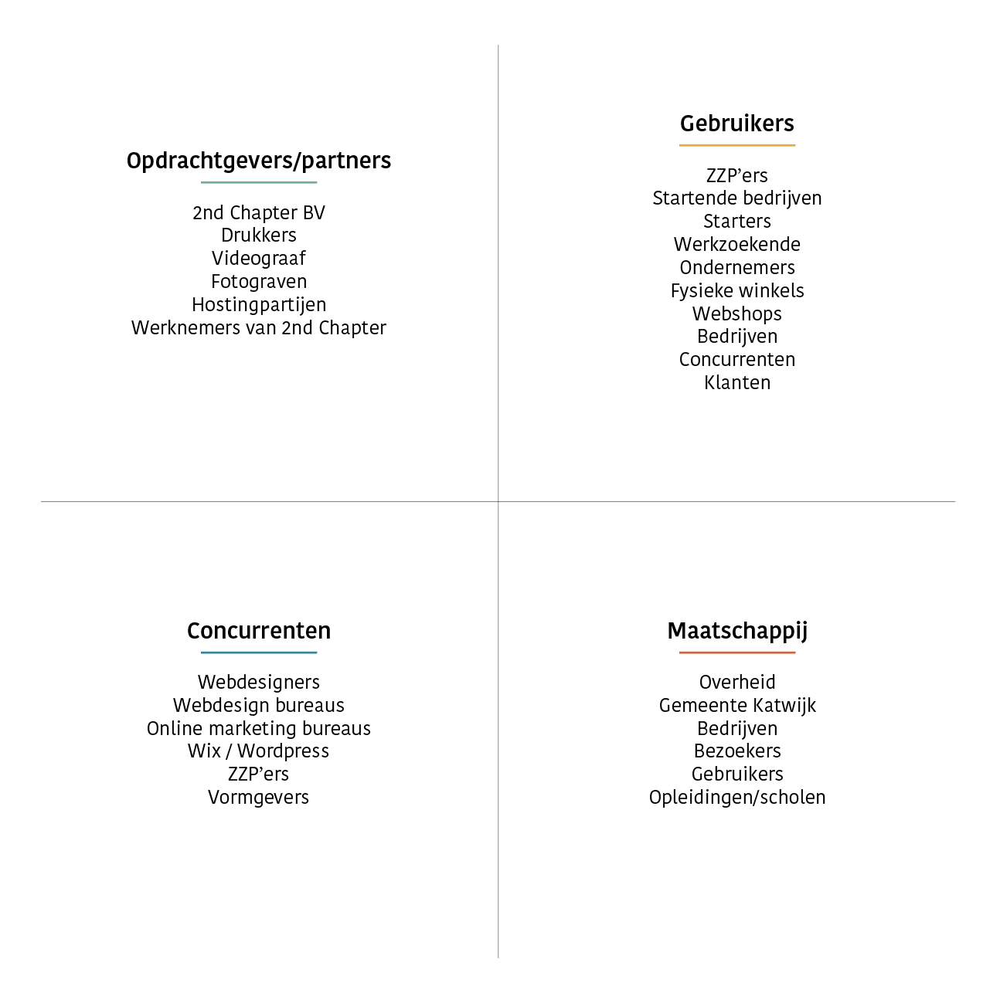
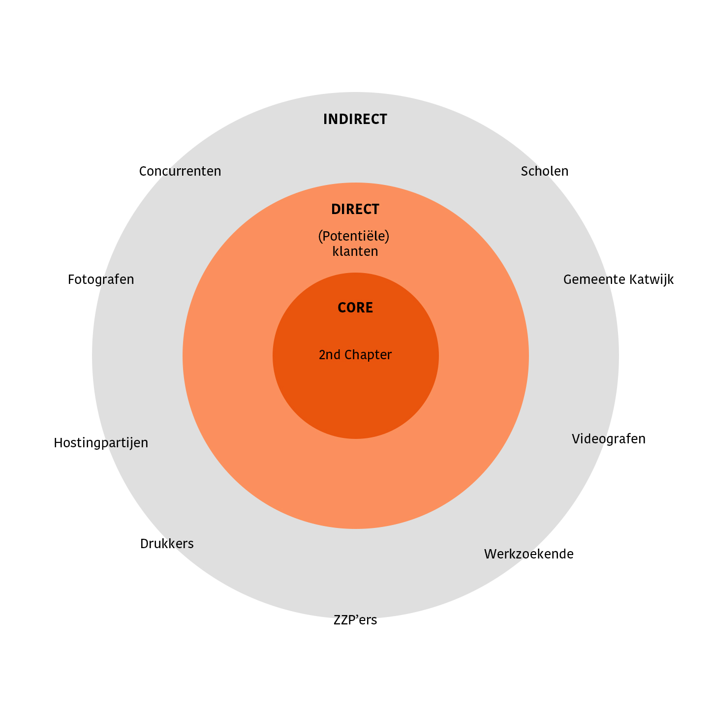

# 1.4 Stakeholders

## Stakeholders lijst

Ik heb een lijst gemaakt met de verschillende stakeholders die bij dit project betrokken zijn.

Deze stakeholders heb ik nog even geplaatst in een overzicht van core, direct en indirecte stakeholders.

De belangrijkste stakeholders beschrijf ik hieronder.

## Stakeholder 1: 2nd Chapter 

Behoefte \(zeker\)

* Meer conversie via de website. \(In de vorm van: contact opnemen, formulier invullen, blog lezen\)
* Meer \(potentiële\) klanten bereiken. Doormiddel van beter vindbaar worden op Google. Meer mond-tot-mond reclame genereren
* Een website die functioneert als online visitekaartje voor het bedrijf. Het bedrijf moet zich kunnen identificeren met de site. 
* Technisch vooruitstrevend
* Unieke website
* Duidelijke informatie architectuur

Behoefte \(aanname\)

* Een website die nog jaren mee vooruit kan
* Beter dan de concurrentie
* Makkelijk om te zetten naar andere talen
* Semantisch gebouwd

## Stakeholder 2: Ondernemer

Behoefte \(zeker\) 

* Onderneming uitbreiden en winstgevender maken
* Een webshop bouwer vinden die persoonlijke aandacht wil en kan geven aan hem
* Kwaliteitsproduct die uniek is van de concurrentie

Behoefte \(aanname\) 

* De concurrentie voorblijven doormiddel van techniek en design
* Meer naamsbekendheid genereren
* Een webbureau waar geld, kwaliteit boven kwantiteit
* Een bureau die zich aan de afgesproken \(korte\) deadline kan houden
* Flexibiliteit

## Stakeholder 3: Concurrenten

Behoefte \(zeker\) 

* Kijken wat 2nd Chapter als bedrijf aan het doen is

Behoefte \(aanname\) 

* Wat kunnen ze overnemen van 2nd Chapter
* Inspiratie opdoen
* Blog lezen
* Prijs vergelijking
* Klanten bekijken
* Portfolio bekijken

