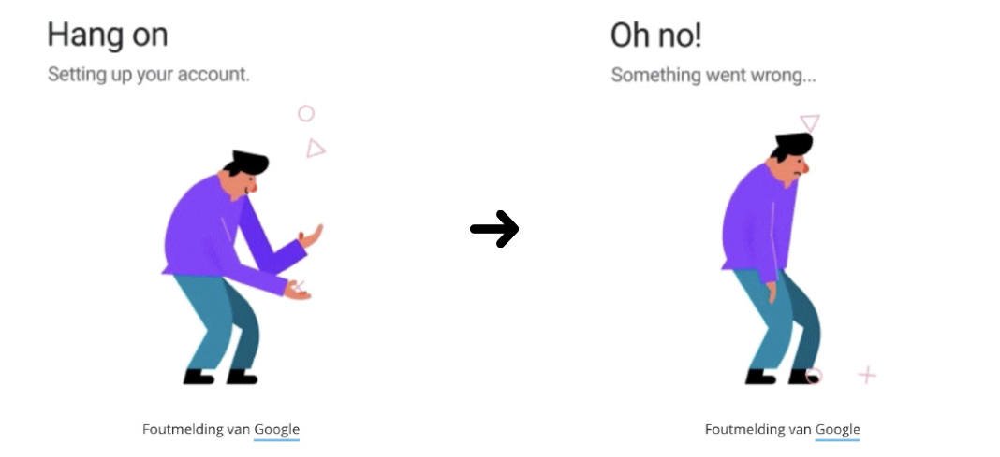
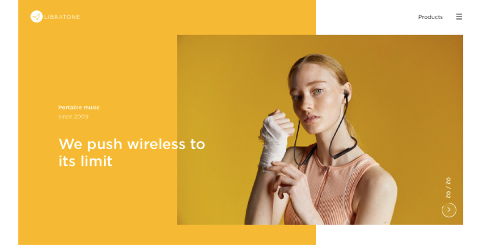

# 1.5 Trends

## Animaties op het web

> “Beweging wordt steeds subtieler: een blokje valt niet – baf – op je scherm, maar strijkt zachtjes neer. Een knopje golft. Data stuitert binnen. UI-animaties zijn heel fijn voor de gebruiker, zijn acties krijgen antwoord.”  
> _\(Désirée Battjes, Beau van Essen, 10-12-2018\)_

Animaties zie je tegenwoordig op bijna elke website terug. Dit kunnen kleine animaties zijn zoals een product die vliegt naar een winkelmand of een button die van vorm en kleur verandert. Ook zie je steeds meer grotere animaties terug komen op het web. Dit is fijn voor de gebruiker omdat hij feedback krijgt als hij een actie uitvoert op de site. Een ander voordeel is dat de pagina wat dynamischer wordt tijdens het bezoek.

## Bewegend beeld

> “Bewegend beeld is sexy. Video op een home- of landingpage laat geen enkele gebruiker onberoerd. Maar let op. Een promofilm integraal neerkwakken, leidt enorm af. Beeld – ook videobeeld – moet bij binnenkomst ondersteunend zijn. Als plakje leven. Korte shots, sfeerbeelden, liefst zonder geluid en eventueel met blur of filter. Goed uitgevoerd is video als illustratie onweerstaanbaar.”   
> \(Désirée Battjes, Beau van Essen, 10-12-2018\)

Beeld wordt steeds belangrijker op het web. Goede videos kunnen veel toevoegen aan een pagina. Zoals Désirée en Beau al vermelden moeten de shots kort zijn en vooral niet afleiden. Laat dus het geluid achterwegen en blur eventueel zelfs de beelden.

## Minimalism

“Perhaps one of the most classic and timeless web design trends, minimalism is often the go-to aesthetic of choice. The fewer elements and content on a website, the less your audience will have to think. If a website is designed in the right way, it will show the user exactly what she is looking for.”  \(Lennart de Ridder, z.d.\)

Je wilt een bezoeker niet overspoelen met informatie en content. Een minimalistische site past goed bij 2nd Chapter. Niet veel content op de site, de content die er is moet voor zichzelf spreken. Dit gebeurt door de design die erachter zit. 

## Transitions

> “Even simple transitions can serve to elevate your design. Designers are exploring a variety of section-based transitions that can be vertical or horizontal. Plus, with advanced parallax effects, it’s becoming easier for designers to make specific elements or copy stand out on the page.”   
> \(Alexandra Mercier, 29-11-2018\)

Pagina overgangen zie je steeds meer terugkomen op het web. Ze moeten wel subtiel zijn, de content blijft het belangrijkste. Een goede overgang zorgt ervoor dat je de bezoeker triggert om meer te ontdekken op de site. 

