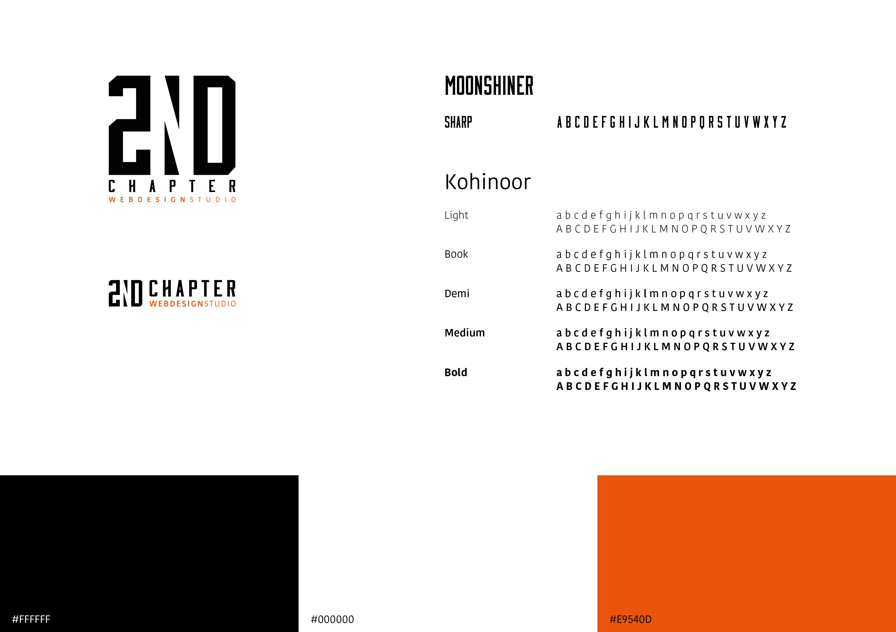

# 1.9 Design specifications

Samen met de opdrachtgever ben ik door de huidige site gelopen. Dit heb ik gedaan om erachter te komen wat hij van de website vind. Wat vind hij belangrijk, wat moet blijven en wat moet veranderd worden. De huidige pagina is een one-page, dus ik heb met screens gewerkt.



## Huisstijl

In deze tegel staan de belangrijkste huisstijl elementen van 2nd Chapter. Twee manieren om het logo te gebruiken. Drie hoofdkleuren die worden gebruikt en de twee fonts.

