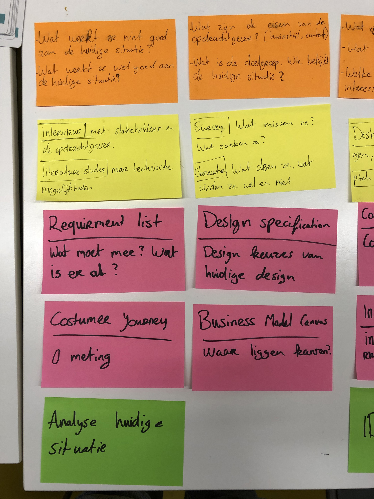
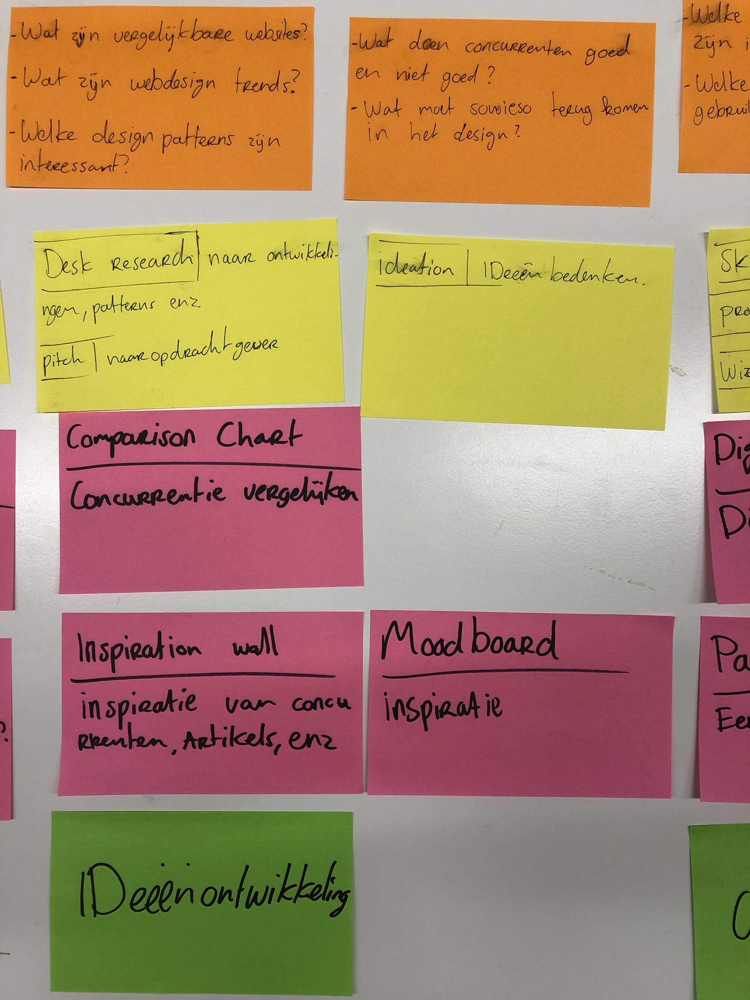
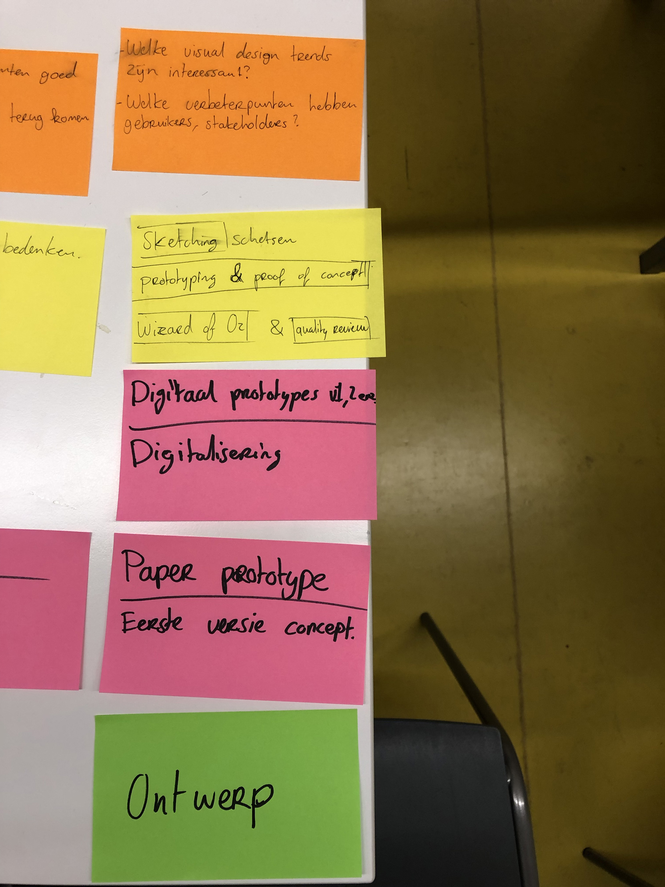
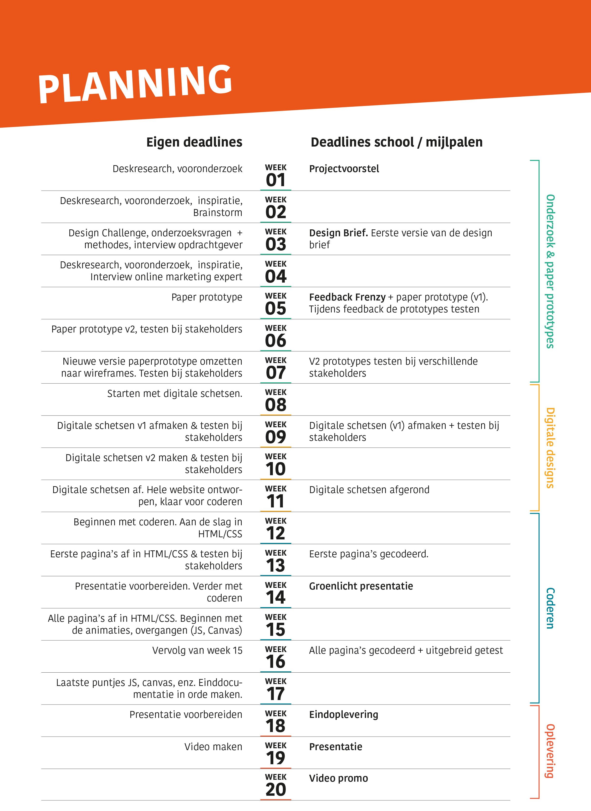

# 1.7 Planning

## In dit hoofdstuk

* Workshop planning
* Trello
* Planning
* Aanpassingen n.a.v. feedback

## Workshop **planning**

Net als de design brief workshop kregen we van de opleiding ook een planning workshop aangeboden. Het idee van de workshop was om al een begin aan je planning te maken voor de komende 18 weken. Deze planning moest onderzoeks- en inspiratie vragen bevatten. In de laag daarna moest je onderzoeksmethodes zoeken die je vragen kan beantwoorden. Als laatst moest de planning een opsomming van deliverables worden.

### Fase 1: Analyse huidige situatie

De eerste fase van mijn project is 'analyse huidige situatie'. De deliverables die ik hiervoor wil doen zijn:

* Requirement list
* Design specification
* Costumer Journey
* Business Model Canvas

Hierna heb ik onderzoeksvragen bij deze fase bedacht, dit zijn de volgende:

* Wat werkt er niet goed aan de huidige situatie?
* Wat werkt er wel goed aan de huidige situatie?
* Wat zijn de eisen van de opdrachtgever? \(huisstijl content\)
* Wat is de doelgroep? Wie bezoekt de huidige website?

Om deze onderzoeksvragen te beantwoorden wil ik de volgende onderzoeksmethodes gaan doen:

* Interviews
* Literature studies
* Survey
* Observatie

### Fase 2: Ideeën ontwikkeling 

De tweede fase van mijn project is 'ideeën ontwikkeling'. De deliverables die ik hiervoor wil doen zijn:

* Comparison chart
* Inspiration wall
* Moodboard

Onderzoeksvragen:

* Wat zijn vergelijkbare websites?
* Wat zijn de webdesign trends?
* Welke design patterns zijn er interessant?
* Wat doen de concurrenten wel goed en wat doen ze niet goed?
* Wat moet sowieso terug komen in het concept?

Onderzoeksmethodes:

* Desk research
* Pitch
* Ideation

### Fase 3: Ontwerp

De derde fase van mijn project is 'ontwerp'. De deliverables die ik hiervoor wil doen zijn:

* Paper prototype
* Digitaal prototype

Onderzoeksvragen

* Welke visual design trends zijn interessant voor mijn project?
* Welke verbeterpunten hebben gebruikers, stakeholders?

Onderzoeksmethodes:

* Sketching
* Prototyping & proof of concept
* Wizard of oz
* Quality review

## Trello

Om mijn planning levendig te houden heb ik ervoor gekozen om te werken met Trello. Ik werk met blokken die staan voor een aantal weken. Ik geef aan met geel dat ik bezig ben met een taak, groen betekend dat ik die afgerond heb. De onderzoeksvragen heb ik niet verwerkt in de planning, deze staan op Gitbook. 

Trello: [bekijk planning](https://trello.com/invite/b/jQFwgL4k/92e7a7bb571cec8f5dca06650616bfbf/afstuderen) 

## Planning

Naast Trello heb ik nog een planning gemaakt met de deadlines/mijlpalen vanuit school en mijn eigen deadlines. Ik vond het handig om één duidelijk overzicht te hebben van de opdrachten die ik moet doen. Ik heb het onderverdeeld in 4 fases en deze heb ik allemaal een kleur meegegeven.  

## Aanpassingen n.a.v. feedback: 

Feedback Irene \(tweede lezer\):

> Je geeft aan dat je 6 weken hebt uitgetrokken voor het coderen: dit zie ik niet terug in jouw planning: daar zie ik 1 week voor de groenlicht presentatie. Dit lijkt mij veel te weinig, met name omdat hier de focus op komt te liggen.

Had was mij nog niet helemaal duidelijk dat tijdens de groenlicht presentatie het project al voor 80% af moest zijn. Ik had daar in mijn planning geen rekening mee gehouden. Hierdoor heb ik dus te weinig \(1week\) tijd ingepland voor het coderen. Dit heb ik in Trello aangepast, ik heb minder tijd voor de onderzoeksfase ingepland en meer voor het maken. Hier ligt ook de uitdaging van mijn project. Ik begin nu in week 10 met het coderen van de website.

Ik heb deze verandering doorgevoerd op mijn Trello planning. 

