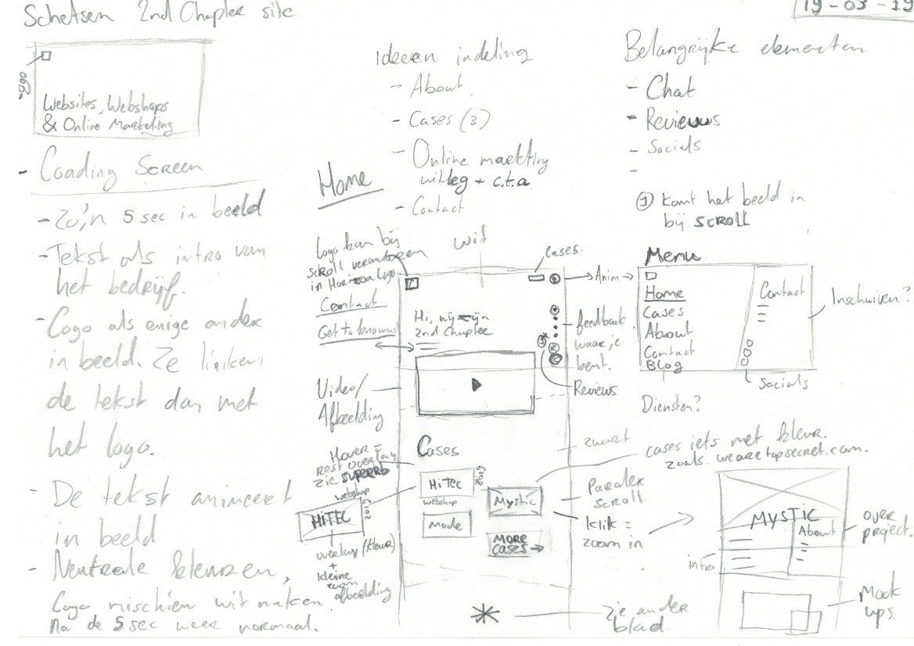

# 3.2.1 Schetsen

Na het onderzoek ben ik begonnen met de eerste schetsen van de website. Ik heb rekening gehouden met de stakeholders van het project. Bij elke pagina heb ik een indeling gemaakt. Ook beschrijf ik wat voor onderdelen er in ieder geval terug moeten komen op de website.

## Loading screen, hamburger & home

**Loading screen**  
In het loading scherm van de website wil ik al wat laten zien over het bedrijf. Dit is een korte zin met wat het bedrijf kan betekenen voor de bezoeker. Dit gaat worden "websites, webshops & online marketing". Verder is er op deze pagina nog een logo te zien. De focus moet liggen op de zin die in beeld komt. Inspiratie voor dit idee komt van de [website](https://www.buildinamsterdam.com/cases) van 'Built in Amsterdam'.

**Hamburger-menu**  
Ik wil graag een full screen menu op de site. Het hamburger icoon scrollt mee de pagina en zal altijd op de zelfde plek \(rechtsboven\) staan. De navigatie items in het menu zijn groot en trekken de aandacht van de bezoeker. Rechts van het menu zal een blok komen met wat korte contactgegevens & de social kanalen. 

**Home**   
De onderdelen die direct in beeld komen op de site zijn het logo, cases- en hamburger menu knoppen, Chat- en review knoppen en een openingstekst. De openingstekst bevat een persoonlijke titel zoals 'Hi, wij zijn 2nd Chapter', ik wil direct het persoonlijke in de site brengen. Na de header begin ik met een foto/video die ook het persoonlijke terugbrengt. 

Na dit onderdeel komen de cases, dit worden foto's. Naast de foto's komt metadata over dit project. Als je over een afbeelding gaat met je muis dan zal er een titel van het project verschijnen. De cases hebben allemaal een eigen kleur, de metadata en titels zullen ook in deze kleur zijn. 

Na de cases komt er een stuk over online marketing \(zie afbeelding 2\). Dit is een belangrijk onderdeel van het bedrijf en dit komt nog niet goed over op de huidige website. Er zal een korte inleiding komen en daarnaast wat onderdelen van online marketing met een korte tekst erbij en een doorlink knop.

Dan komen de klanten met hun logo's in beeld. Deze zullen in zwart wit getoond worden, als je er overheen gaat met de muis dan zullen de logo's in kleur verschijnen.

In de footer komt er een grote call-to-action om contact op te nemen. De tekst 'Koffie doen' veranderd in een andere tekst na een aantal seconden. In de bottem zal nog wat contactgegevens vermeld worden. Ook komen daar de copyrights en voorwaarden terug.

## About

