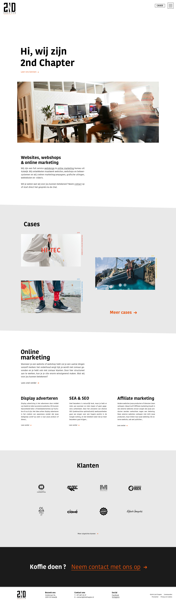
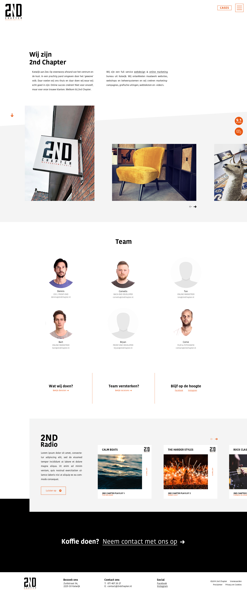
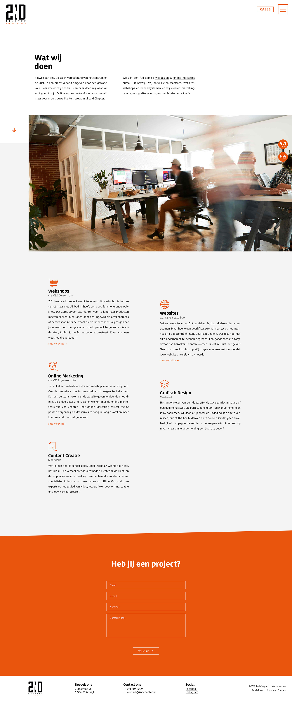
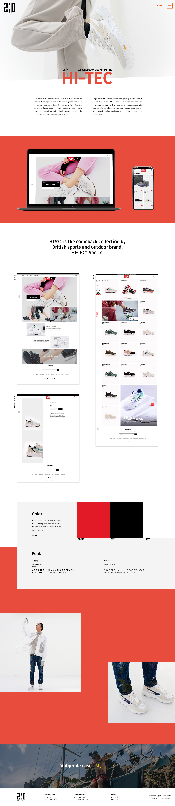
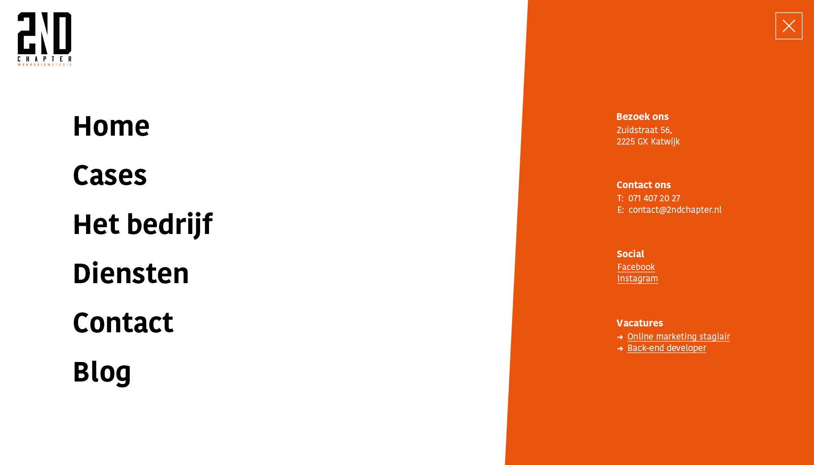
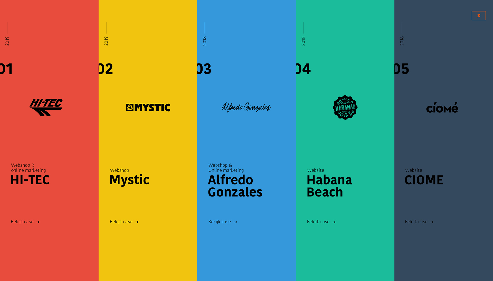

# 3.2.3 Digitale schetsen

Na mijn wireframes ben ik aan de slag gegaan met digitale schetsen. Ik wilde de wireframes namelijk designen zodat ik een beter beeld zou hebben van hoe mijn concept er uit zou zien met \(fake\) content. De digitale schetsen zagen er als volgt uit:

## Home

## Het bedrijf

## Diensten

## Case-detail pagina

## Navigatie

## Case navigatie

