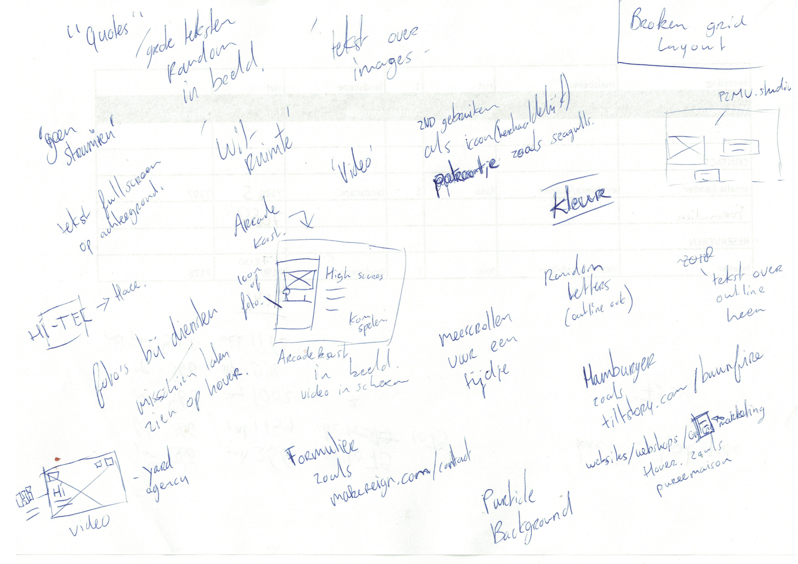

# 3.2.5 Feedback & Test

Ik heb de designs aan een aantal mensen laten zien en feedback hierop gevraagd. Dit gaat om alle mensen binnen 2nd Chapter en daarnaast nog vrienden en familie. Ook heb ik twee klanten gevraagd om er naar te kijken en hun mening te geven. Deze twee klanten komen regelmatig over de vloer bij 2nd Chapter.

## Aantekeningen 

## Belangrijkste feedback opsomming

* Meer uitdaging, het is te 'netjes'
* Meer spelen met kleur en font gebruik
* Proberen om meer humor terug te brengen. 2nd is een jong bedrijf waar jonge mensen werken. Humor komt ook terug op de social media kanalen van het bedrijf
* Foto's bij diensten om aandacht te trekken
* Geen vast stramien gebruiken
* Lijkt het niet teveel op de huidige site?
* Misschien kan je iets doen met de arcade kast die op het kantoor staat
* Broken grid lay-out
* Items die mee-scrollen voor een bepaalde tijd
* Diensten en het bedrijf samenvoegen?
* Meer gebruik van trends zoals gradient/outline text
* Waar wordt er verteld over de diensten? I.p.v ingaan op online marketing meer vertellen ook over de andere diensten.

