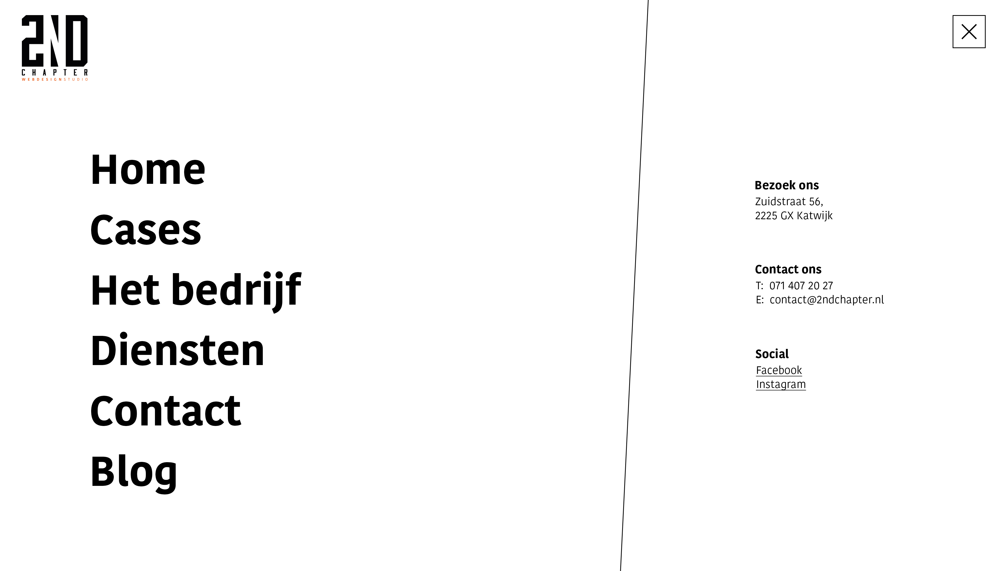
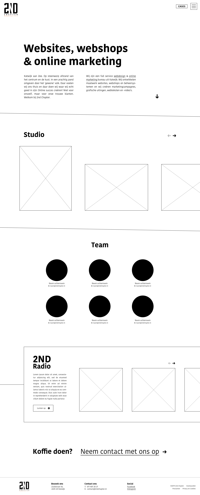
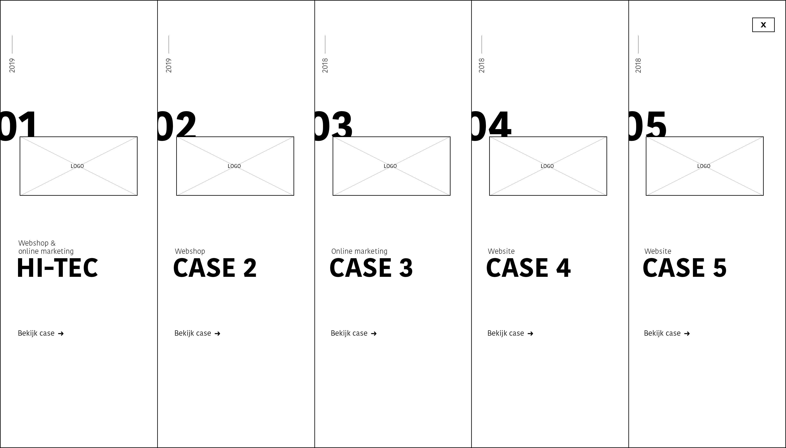

# 3.2.2 Wireframes

Na de schetsfase ben ik bezig gegaan met het digitaliseren van de schetsen. Dit heb ik gedaan door wireframes te maken. In de wireframes maak ik nog geen gebruik van echte content, ook de huisstijl heb ik nog niet meegenomen. Wel heb ik rekening gehouden met hoeveel ruimte ik nodig ga hebben en wil gebruiken voor tekst en fotografie. Ik heb wireframes gemaakt van de volgende pagina's:

* Home
* Hamburger - menu
* Het bedrijf
* Diensten
* Case - detailpagina
* Case - menu

### Prototype

Toen de wireframes klaar en naar wens waren heb ik werkend prototype hiervan gemaakt in Adobe XD.   
Link: [https://xd.adobe.com/view/8de84d9b-08f7-4b29-6d06-933868ecb943-fbd9/](https://xd.adobe.com/view/8de84d9b-08f7-4b29-6d06-933868ecb943-fbd9/)

 

