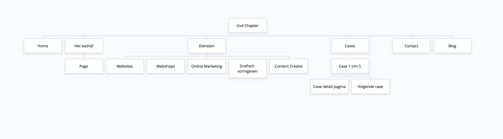
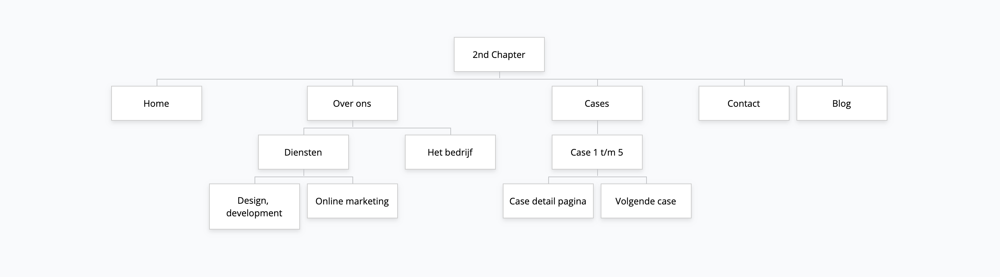

# 3.1 Sitemap

## V1

## V2

In deze versie heb ik ervoor gekozen om 'het bedrijf' en 'diensten' samen te voegen als één pagina. Na wat tests ben ik er namelijk achter gekomen dat de gebruikers op de pagina 'het bedrijf' ook al wat diensten verwachten. De diensten gaan nu kort worden uitgelegd op deze pagina met daarbij een doorlink naar een tekstpagina waar er dieper op in wordt gegaan. 



