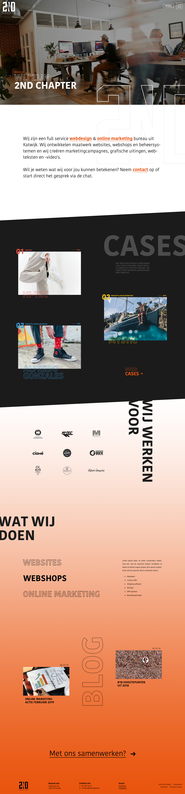

# 3.3.2.1 Home

## Home

De belangrijkste pagina van de hele site. Hier heb ik dan ook veel tijd aan besteed. Het leek me toch een goed idee om te beginnen met een full-screen header waar een video in komt. Daar overheen is de outline van het 2ND logo te zien. Deze trekt door als je scrollt. De tekst na de header is erg belangrijk, daarom heb ik ervoor gekozen om deze erg groot te doen. De oranje stukken zijn linkjes naar een aparte pagina waar de bezoeker meer te weten kan komen over deze onderwerpen. 

Na deze tekst komt het twee na belangrijkste van de site, de cases. Ik heb doormiddel van kleur de cases onderverdeeld. Elke case krijgt zijn eigen kleur. De zwarte achtergrond zorgt ervoor dat de fotografie en kleuren van de cases extra opvallend zijn.  

De diensten heb ik omgegooid. In het vorige concept ging ik vooral in op online marketing en vertelde ik op de homepage niets over websites en webshops. Dit keer heb ik deze drie onderwerpen onder 'Wat wij doen' geplaatst. Je kan een hover doen met je muis, dit zorgt ervoor dat de tekst naast de titels veranderd. 

Blog heb ik ook nog toegevoegd aan de homepage. Op deze manier komen alle navigatie items terug op de homepage. Daarnaast is de blog een nieuwe onderdeel die nog niet op de huidige pagina te vinden is, daarom wil ik hem wat meer aandacht geven.

  
Ik heb ervoor gekozen om twee hamburger menu’s naast elkaar te plaatsen. De cases krijgen een apart menu. Veel bezoekers komen naar de website om te kijken wat het bedrijf allemaal kan. De cases zijn daar de ideale mogelijkheid voor. Doordat ik nu een aparte cases menu heb valt die direct op en kunnen de bezoekers direct naar de gewenste case toe.

