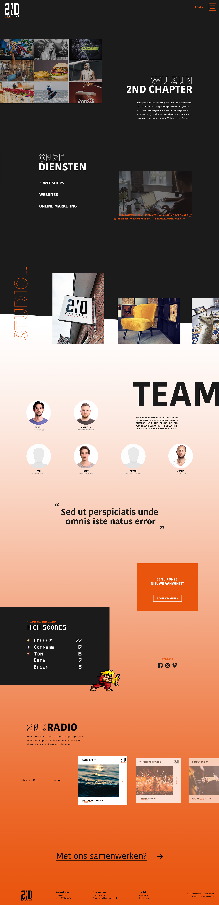

# 3.3.2.2 Over ons

## Over ons

De over ons pagina heb ik flink uitgebreid. De diensten zijn nu ook toegevoegd aan deze pagina, deze komen in het zwarte gedeelte terug. Ik begin met een introductie van het bedrijf met daarnaast een collage van fotografie van onze klanten. Door de zwarte achtergrond grijpt de tekst direct de aandacht. De outline tekst komt ook hier weer terug net als op de homepage. Ik heb express gekozen om de titels en outlines andere groottes mee te geven. Zo houd ik de site visueel interessant en val ik niet in herhaling.

Na het team probeer ik de humor op de site te brengen. Ik begin met een quote die vaak op het kantoor wordt gezegd, deze moet ook leuk zijn voor de bezoeker. Deze quote scrollt mee zodra je naar beneden gaat. Daarna komen wat blokken met vacatures en high scores met street fighter. Er is namelijk regelmatig een toernooi op het kantoor. Als laatste is er een kopje over 2nd Radio. Dit zijn afspeellijsten die worden gemaakt door de werknemers van 2nd Chapter. De high scores, quotes en afspeellijsten zorgen ervoor dat de site een persoonlijk tintje meekrijgt. De bezoeker wil weten met wat voor bedrijf ze te maken hebben. 

