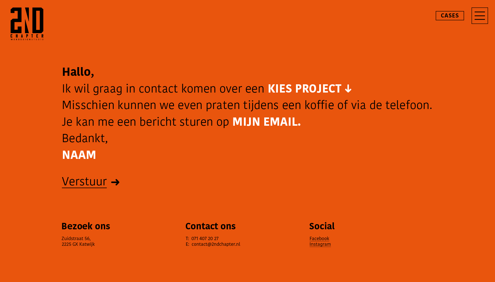

# 3.3.2.5 Contact

## Contact

In dit concept heb ik ook alvast de contact page ontworpen. Ik kreeg ook als feedback op mijn eerste concept waar deze pagina was en hoe deze vormgegeven ging worden. Ik wilde iets anders doen dan de standaard contact page met wat gegevens en een invul formulier. Ik heb er nu een lopend verhaal van gemaakt waar de witte kopjes drop down menu's/ invul velden worden. De bezoeker kiest dus om wat voor project het gaat, bijvoorbeeld: online marketing, webshop of website. Vervolgens vult hij z'n email en naam in. 2nd Chapter kan dan terug mailen naar de bezoeker.

