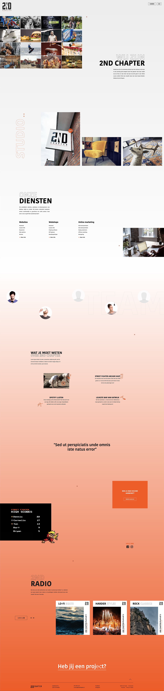

# 3.3.4.2 Over ons

### Aanpassingen die ik heb gedaan zijn:

* Het zwarte was te druk en paste niet goed in lijn met de pagina. Daardoor heb ik ervoor gekozen om aan de bovenkant van de pagina een grijze gradient te doen. Deze loopt over naar wit, die vervolgens daaronder weer overloopt naar de oranje kleur van de huisstijl
* Diensten zijn meer uitgeschreven. De bezoekers krijgen al wat woorden te zien over elementen die 2nd Chapter als bedrijf doen.
* Het team is wat meer willekeurig verdeeld, daarnaast ben ik afgezien van de grote zwarte titel, daar lag teveel nadruk op.
* Elementen over het bedrijf inclusief gifs. Ik wilde de humor meer terug laten komen op de site. Op social media en in de nieuwsbrief gebruikt 2nd Chapter vaak humor, ook in de vorm van gifs. Ik heb wat leuke feitjes geplaatst inclusief gifs als je eroverheen hovert. 

## Onderbouwing

De pagina achtergrond is een gradient die van grijs naar wit naar oranje gaat. Dit zijn kleuren van 2nd Chapter. Het geeft de pagina een interessant en mooi effect tijdens het scrollen.

De pagina begint met een afbeelding grid van verschillende klanten die 2nd Chapter heeft met daarnaast een introductie tekst over het bedrijf.

Ik wil het persoonlijke terug laten komen, daarom heb ik daarna een carousel gemaakt met foto’s van het bedrijf. Voor nu zijn dit foto’s van en in het kantoor. Het kantoor heeft een huiskamer gevoel, dit wilde ik ook laten zien op de site.

Diensten is een belangrijk onderdeel van de pagina. Bezoekers willen uiteraard weten wat er gedaan wordt in het bedrijf. Hier staat in het kort informatie over de diensten die geleverd worden en wat daar precies onder valt. Verder is er nog een knop waar de bezoekers meer informatie kunnen krijgen.

Humor en het persoonlijke wilde ik op deze pagina terugbrengen. Daarom is alles onder diensten een bijdrage daaraan. Ik heb gebruikt gemaakt van gifs die ook vaak terugkomen op de socials en nieuwsbrieven van 2nd Chapter.

2nd Chapter heeft een arcadekast op kantoor staan. Veel klanten die binnenkomen voor een gesprek willen graag een spel spelen of vragen er iets over. Daarom heb ik een high-score blok toegevoegd, dit kan een trigger zijn om bezoekers op kantoor te laten komen.

Er wordt veel muziek gedraaid op het kantoor. Iedereen heeft zijn eigen muzieksmaak en dus ook afspeellijst. De bezoekers van de website kunnen deze lijsten beluisteren.

