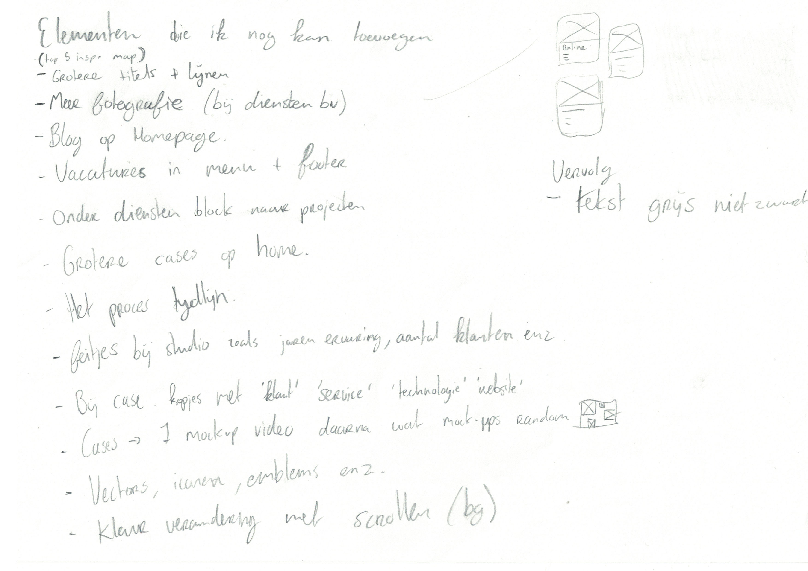
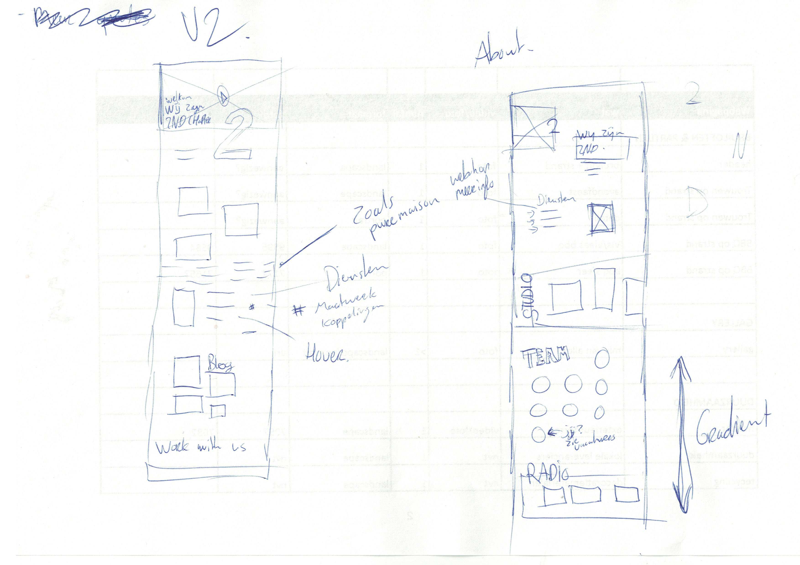
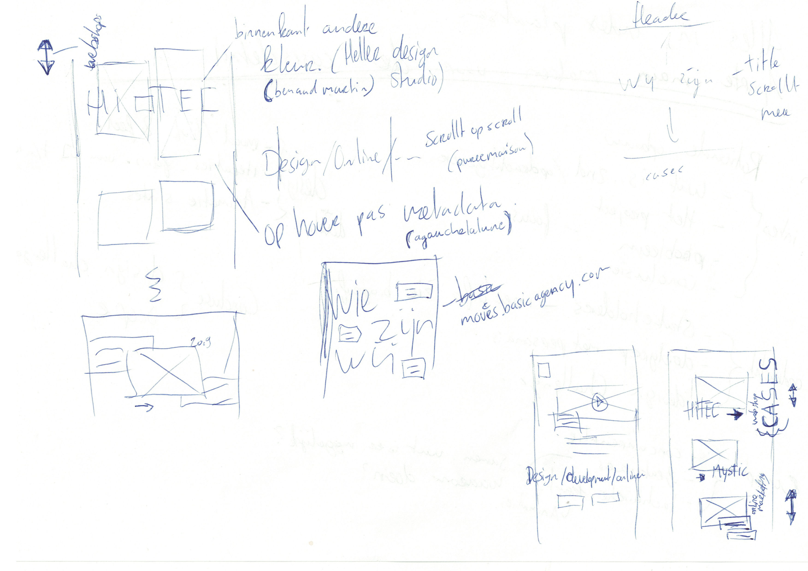

# 3.3.1 Schetsen

Voorafgaand aan deze schetsen heb ik ontzettend veel sites bekeken en inspiratie opgedaan. Deze heb ik opgeslagen in een map in mijn browser zodat ik hier altijd op kan terugvallen. Ik heb een lijst gemaakt met wat elementen die ik ook zou kunnen gebruiken op de 2nd site.

Na het zoeken en opschrijven van inspiratie ben ik begonnen met schetsen. Voor dit concept heb ik korte schetsen gemaakt. Ik heb wat tekst en links erbij gezet naar wat online inspiratie die ik heb opgedaan. 

