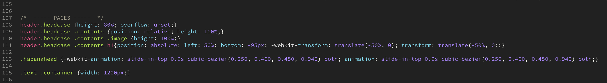

# 4.2 HTML / CSS

## Mappenstructuur

Ik probeer mijn bestanden zo duidelijk mogelijk te structuren. Ik heb deze structuur meegekregen uit mijn stage-adres. Alle HTML bestanden zitten los maar alle andere bestanden zijn wel te vinden in een map. In de image map zitten een aantal mappen zoals icons, logo & demo, zo kan ik makkelijk bestanden vinden en oproepen. Het is de bedoeling dat de mappenstructuur zo duidelijk en eenvoudig is dat een collega het direct kan oppakken.

## HTML

Ik probeer mijn HTML bestand altijd zo duidelijk mogelijk te structureren. Ik gebruik veel 'tabs' om aan te geven als er zich een child in de parent bevind. De namen van de classes geef ik een duidelijke benaming, hier probeer ik altijd al te vertellen wat het is en waar het zich bevind.    

## CSS

Ik heb voor dit project vier CSS bestanden gebruikt. Ik probeer zoveel mogelijk in een CSS bestand te doen zodat ik niet de hele tijd moet switchen tussen de bestanden. Uitleg van mijn CSS bestanden:

* **Cursor.css** - Alle CSS betreft mijn custom cursor, deze heb ik een keer gemaakt en pas ik daarna bijna niet meer aan dus dat heb ik graag in een aparte file.
* **Hamburger.css** - De regels voor de hamburger menu's. 
* **Index.css** - Hier zitten alle pagina's in. Een groot bestand met over 450 regels. Ik breng structuur aan doormiddel van logisch ordenen en comments te plaatsen.
* **Styles.css** - Hier zitten de standaard style elementen in die vaak terugkomen op de site. Voorbeelden hiervan zijn `body, a, section, h1,h2.., strong` enz.

Tijdens mijn stage periode heb ik de workflow van mijn collega's overgenomen. Vroeger schreef ik de CSS regels altijd onder elkaar. Ik deed dus na elke declaraties een enter. Dit zorgde ervoor dat ik oneindige CSS bestanden kreeg en ik altijd moest zoeken in het bestand doormiddel van CMD+F. Ik ben toen gaan proberen om de declaraties achter elkaar te schrijven. Dit resulteerde in sneller werken, minder lange CSS bestanden en meer overzicht.

