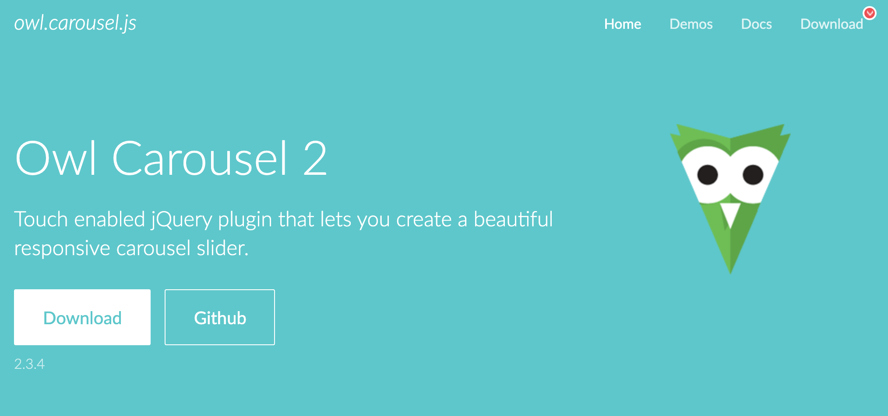
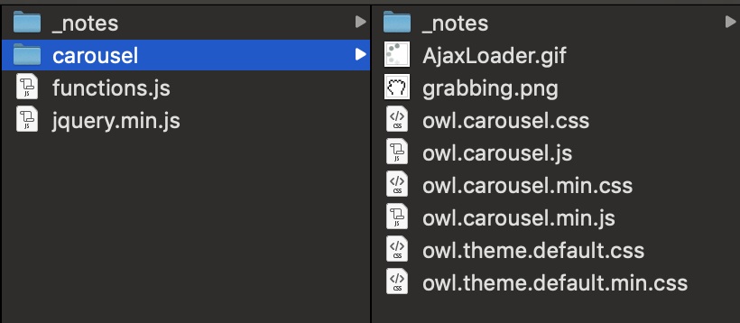

# 4.3.3 Carousel

## Owl Carousel 2

Voor de carousel op de website gebruik ik een library genaamd Owl Carousel 2.



Link: [https://owlcarousel2.github.io/OwlCarousel2/](https://owlcarousel2.github.io/OwlCarousel2/)

Dit bestaat uit de volgende bestanden:



## Waarom?

Tijdens mijn lange stage ben ik begonnen met Owl Carousel 2. In het bedrijf waar ik stage liep werkte ze al jaren met deze plugin. De plugin werkt eenvoudig en heeft veel functionaliteiten. Zo is die volledig responsive en aan te passen naar wens. Dit zorgt ervoor dat je volledige controle hebt over de styling van de carousel. Ook werkt hij in alle \(moderne\) browsers.

## Hoe werkt het?

Om de plugin te laten werken hoef je niets te installeren. De HTML code ziet er als volgt uit:

```text
<div class="owl-carousel studiocar">
	
	
	
	
	
	
</div>
```

Om de items in de carousel heb ik een div geplaatst die de class `'.owl-carousel'` meekrijgt. Deze is belangrijk om de carousel goed te laten werken. Omdat ik meerdere carousels op deze pagina heb staan heb ik nog een extra class `'.studiocar'`  toegevoegd. Zo kan ik onderscheid maken in de functionaliteit en de styling van de verschillende carousels. 

Daarna moeten op dezelfde HTML pagina nog wat scripts worden ingeladen. Dit zijn:

```text
<link rel="stylesheet" href="/js/carousel/owl.carousel.css">
<link rel="stylesheet" href="/js/carousel/owl.theme.default.css">
<script src="/js/carousel/owl.carousel.min.js"></script>
```

Deze linken naar de bijgeleverde bestanden als je de Owl Carousel download. 

### Functionaliteit

De functies van de carousel staan ofwel standaard uit of aan. Dit kan je aanpassen doormiddel van de volgende code.

```text
var owl_studiocar = $('.owl-carousel.studiocar')
	owl_studiocar.owlCarousel({
		dots: false,
		loop: true,
		lazyLoad: true,
		padding: 100,
		responsiveClass:true,
		responsive:{
			0:{
				items: 1
			},
			991:{
				items: 2,
				padding: 50
			},
			1100: {
				items: 3,
			}
		}
	});
```

Loop, lazyload & responsiveClass staan standaard op 'false'. Deze heb ik voor deze carousel op 'true' gezet. Op de [site](https://owlcarousel2.github.io/OwlCarousel2/docs/api-options.html) van Owl Carousel staan de verschillende functies uitgelegd. Daarnaast heb ik aan deze carousel nog een responsive functie meegeven. Boven de 1100px schermbreedte krijg je 3 items te zien in de carousel, tussen 991px en 1099px, 2 items enzovoort. Daarnaast zorgt de padding voor ruimte tussen de items.

## Custom arrows

Normaal kan je de carousel 'besturen' doormiddel van dots. Dit zijn puntjes die aantonen hoeveel items er in de carousel zitten. In mijn design was ik uitgegaan van pijltjes, dus deze wilde ik inclusief functionaliteit aan de carousel koppelen. 

Eerst moest ik daarvoor de normale 'dots' op 'false' zetten, zodat deze niet te zien waren bij de carousel, dit is te zien in de code hierboven. 

Daarna heb ik een extra javascript code toegevoegd aan het script bestand, dit is: 

```text
$('.rotate .controls .left').on('click', function(){
	owl_studiocar.trigger('prev.owl.carousel');
});
	
$('.rotate .controls .right').on('click', function(){
	owl_studiocar.trigger('next.owl.carousel');
});
```

De class waar de arrows inzitten zijn `.rotate .controls .left` & `.right` als je deze klikt dan roept die de functie `.trigger` aan. Vervolgens activeert hij 'prev' bij links en 'next' bij rechts. 

De CSS code die erbij hoort:

```text
.studio .one_fourth .rotate .controls span {
    display: inline-block; 
    width: 20px; 
    height: 16px; 
    background: url(/img/icons/arrow-orange.png) no-repeat center / 20px 16px; 
    transition: 0.2s ease-in; 
    margin-left: 10px;
}
.studio .one_fourth .rotate .controls span:hover {
    opacity: 0.4;
}
.studio .one_fourth .rotate .controls .left {
    -webkit-transform: rotate(180deg); 
    transform: rotate(180deg); 
    margin: 0;
}
```

Ik laad maar een arrow in, deze draai ik vervolgens voor de linker pijl doormiddel van transform: rotate.

## Resultaat:


