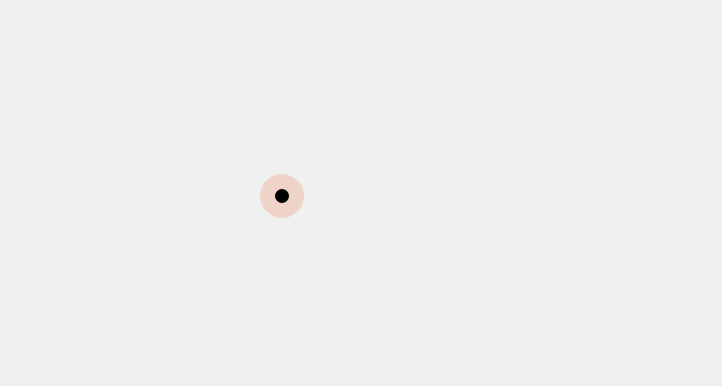
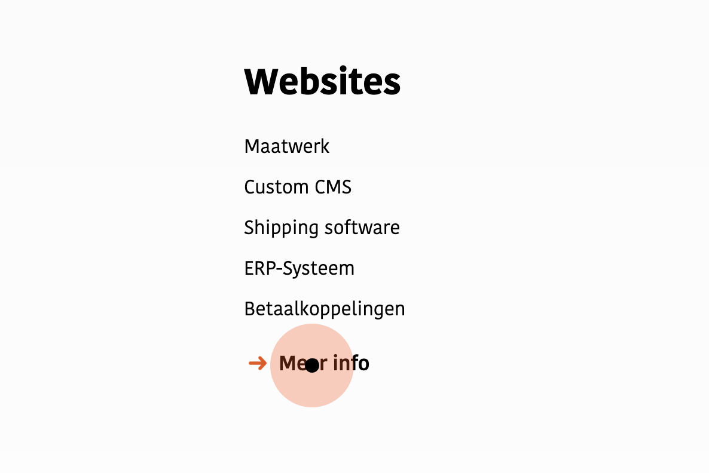
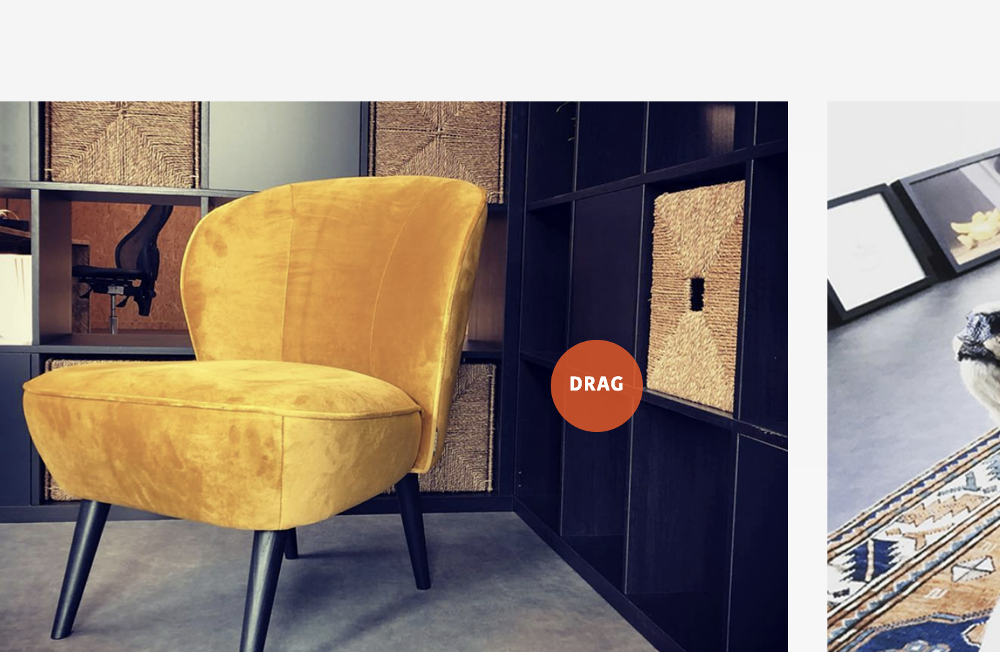

# 4.3.5 Cursor

De cursor op de website wilde ik ook veranderen. De standaard muis wilde ik aanpassen naar een muis in de huisstijl van het bedrijf. Ook wilde ik graag dat de cursor veranderde op/bij bepaalde elementen op de pagina, zoals een pijl of een verschil in formaat.

## Cursor basis

Om de cursor van website te veranderen heb ik ten eerste in de '\*' tag in het CSS bestand de lijn `cursor: none;` dit zorgt ervoor dat de standaard browser cursor niet te zien is. Daarna heb ik in alle HTML bestanden de volgende code geschreven:

```text
<div class="cursor cursor-shadow"></div>
<div class="cursor cursor-dot"></div>
```

#### CSS

De eerste lijn voor de achtergrond van de cursor en de tweede lijn voor de cursor zelf. Aan deze divs zitten een aantal CSS codes verbonden, dit zijn:

```text
.cursor {
width: 7px;
height: 7px;
border-radius: 50%;
position: absolute;
z-index: 1000;
transform: translate(-50%, -50%);
pointer-events: none;
}

.cursor.cursor-shadow {
background: #ff5000;
opacity: 0.2;
transition: all 0.15s ease-out;
width: 22px;
height: 22px;
}

.cursor.cursor-dot {
background: #000;
transition: width .25s, height .25s;
}
```

#### Javascript

Om de cursor werkend te krijgen heb ik Javascript geschreven. Dit is de volgende code:

```text
// CURSOR //
$(window).mousemove(function(e) { 
  $(".cursor").css({
    left: e.pageX,
    top: e.pageY
  })
})
```

#### Resultaat



## Cursor op &lt;a&gt; tag

Op alle linkjes op de pagina wilde ik dat de cursor groter werd dan de standaard, om zo duidelijk te maken dat ze iets met de link kunnen. 

#### Javascript

om dit voor elkaar te krijgen moest ik deze elementen een extra class geven als de muis erover gaat. Zodra je het element weer verlaat met je muis moest deze class ook weer weggaan. Dit ziet er als volgt uit:

```text
// De bovenste elementen krijgen een class active mee als je eroverheen gaat
$("a, .mousehover, .service-head, .drag")
.on("mouseenter", function() {
  $('.cursor').addClass("active")
})

// Als je de elementen verlaat dan krijgt gaat de class active weg
.on("mouseleave", function() {
  $('.cursor').removeClass("active")
})
```

Alle &lt;a&gt; tags krijgen nu een class active mee. door de functie `'mouseenter'` en deze class gaat weer weg door de functie `'mouseleave'`.

#### CSS

De CSS code die ervoor zorgt dat de cursor vergroot:

```text
.cursor-dot.active {
width: 12px;
height: 12px;
background: #000;
}

.cursor-shadow.active {
width: 50px;
height: 50px;
}
```

#### Resultaat



##  Cursor met tekst <a id="cursor-op-less-than-a-greater-than-tag"></a>

Over bepaalde afbeeldingen en op een carousel wilde ik een tekst in de cursor zetten. Dit zijn teksten zoals 'drag' zodat de bezoeker weet dat hij met zijn muis kan slepen om de carousel te laten werken.

#### Javascript

Om dit voor elkaar te krijgen heb ik de volgende javascript code geschreven:

```text
// 'Drag' cursor bij carousels
$(".drag")
.on("mouseenter", function() {
  $('.cursor').addClass("dragmouse")
})
.on("mouseleave", function() {
  $('.cursor').removeClass("dragmouse")
})
```

 Zelfde als de functie die de cursor een class `'active'` meegeeft alleen nu krijgt de cursor een andere class mee namelijk `'dragmouse'`. 

Deze heb ik daarna in CSS aangepast met de volgende code:

```text
.cursor-dot.active.dragmouse::after {
    content: 'DRAG';
    color: #FFF;
    position: absolute;
    z-index: 1000;
    transform: translate(-50%, -50%);
    left: 50%;
    top: 50%;
    font-size: 15px;
    font-weight: 700;
    letter-spacing: 0.8px;
    line-height: normal;
} 

.cursor-shadow.active.dragmouse {
    opacity: 0.8;
} 
```

Ik heb het gedaan door `::after` te gebruiken. Hiermee kan je de content van de HTML aanpassen zonder de HTML zelf direct aan te passen. 

#### Resultaat




