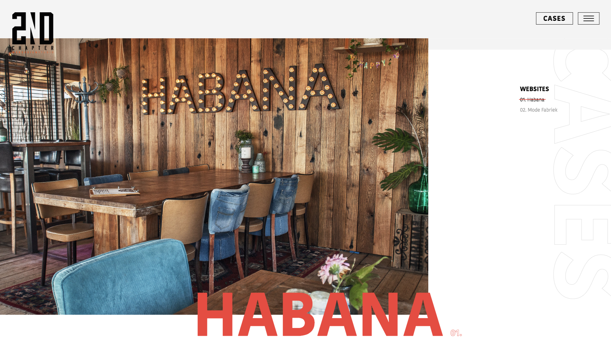
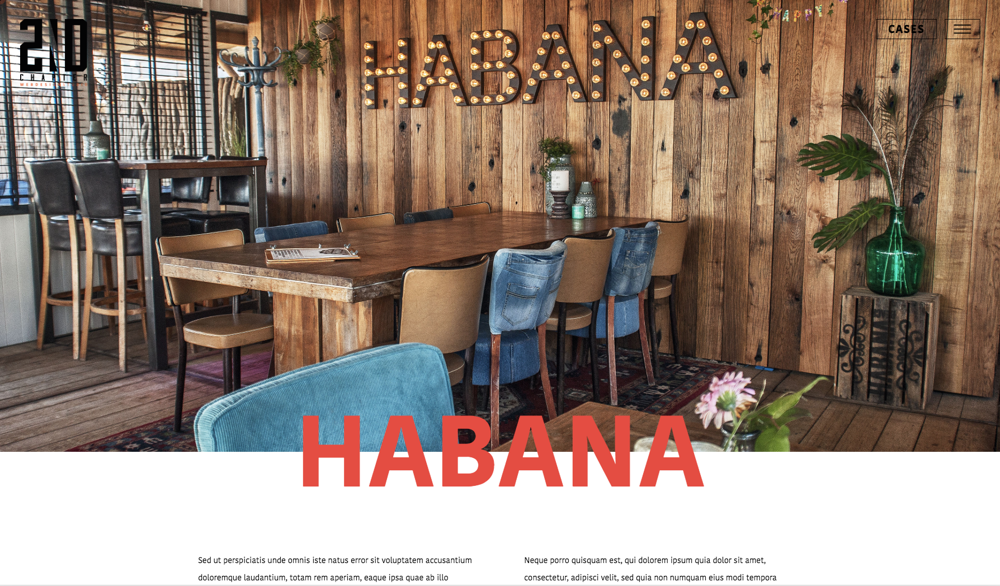

# 4.3.6 Transitions

Tijdens mijn inspiratie onderzoek kwam ik een pagina transition tegen die ik ook wilde gebruiken voor mijn website. De transition die ik graag wou deed het lijken alsof de gebruiker op dezelfde pagina bleef terwijl de content op de pagina wel veranderde. Hier heb ik een code voor geschreven.

### De transition

De transition ging als volgt, je drukt op een afbeelding op pagina 1, deze wordt vervolgens uitvergroot naar de volledige pagina breedte \(100%\) in een soepele beweging. Doordat dit gebeurt lijkt het voor de bezoeker alsof ze op dezelfde pagina blijven terwijl de content onder deze afbeelding verandert. Op deze manier is het navigeren door de website vloeiend. 

### Uitleg

De afbeelding op pagina 1 & pagina 2 hebben dezelfde html/css structuur. Via javascript krijgt de parent een class ‘active’ mee. Deze gaat met CSS op 100%. Ook worden de child classes aangepast naar mijn gewenste resultaat. De titel gaat bijvoorbeeld naar het midden van de pagina.

De gebruiker bevind zich na de klik op een nieuwe pagina, alleen die heeft dit door omdat hij niet ziet dat de pagina ingeladen wordt. In plaats daarvan ziet hij de animatie van de afbeelding.

### De code

```text
$(document).on('click', '.case-item', function(event){
	"use strict";
		event.preventDefault();
		
		var elem 	= $(this);
		var href	= elem.attr('href');
	
		$('html, body').animate({
			scrollTop: elem.offset().top + 0
		 }, 100, function(){
			$('.cases .left').addClass('active');

			setTimeout(function(){
				window.location.href = href;
			}, 1000);
		});
	});
```

### Resultaat






