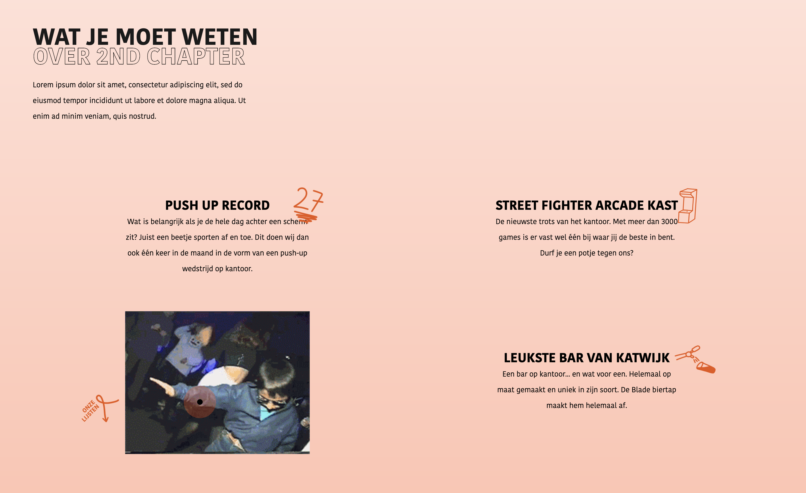
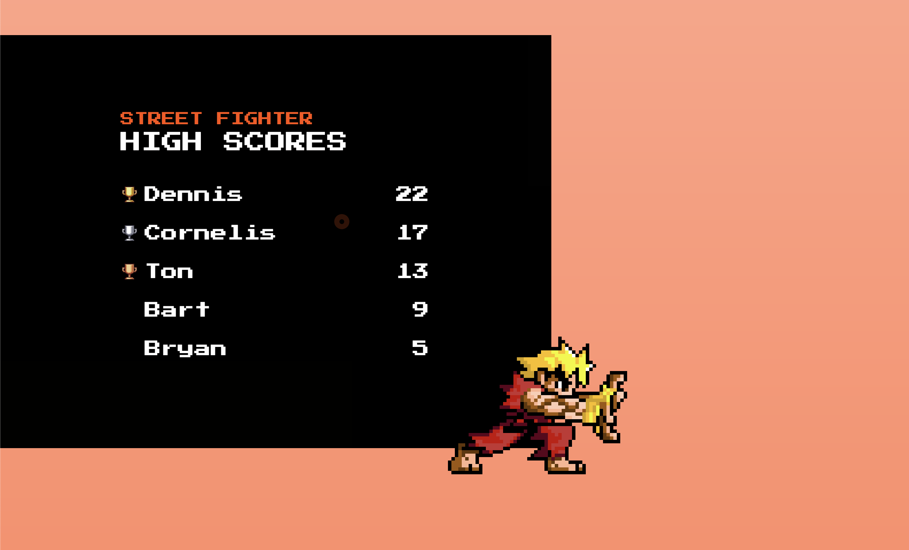
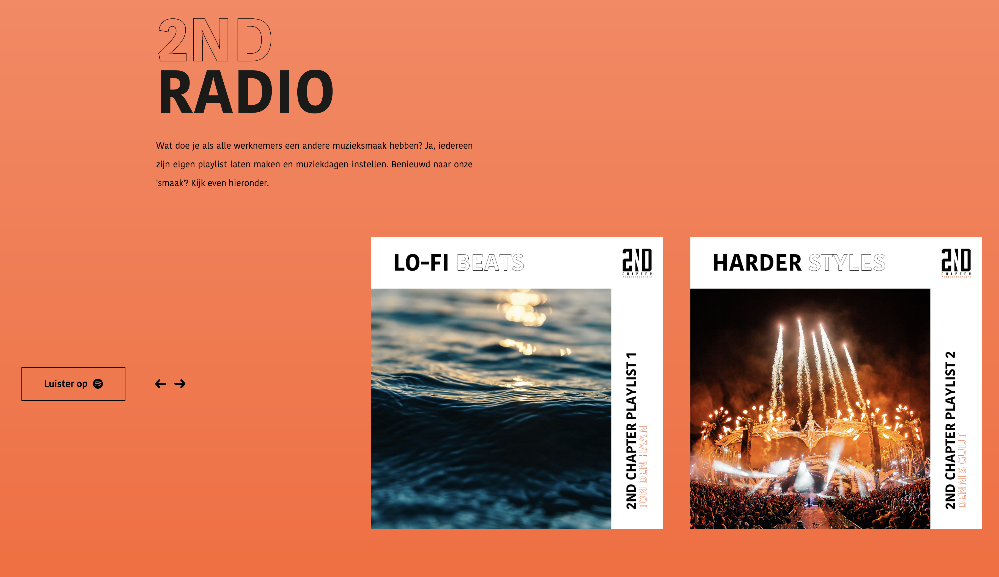
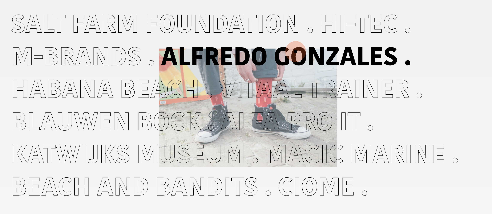
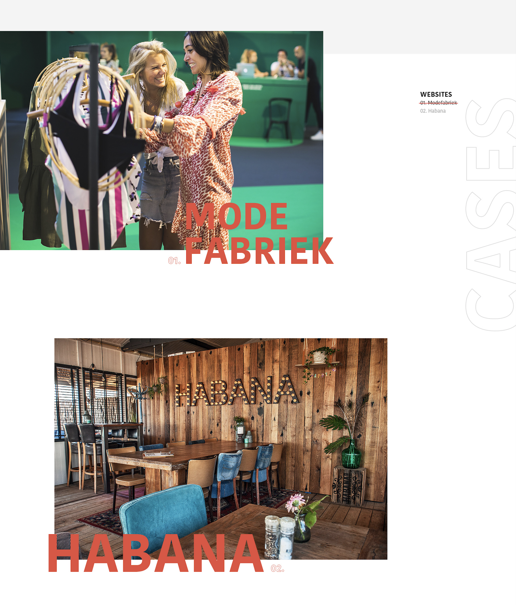

# 5.1.1 Waarom past de site bij 2nd Chapter?

## Humor

Humor was een onderdeel wat mijn opdrachtgever graag terug wilde zien op de nieuwe site. 2nd Chapter is een jong team en zo uiten ze zich ook in hun taalgebruik op social media. Ze schrijven luchtig en plaatsen vaak grappige/sarcastische stukken tekst.  Toch vond ik het best lastig om humor op een toch wel zakelijke website te krijgen. De lijn tussen grappig en irritant is dun. Daarnaast wil je niet klanten wegjagen omdat ze je niet meer serieus nemen. 

Daarom heb ik de humor vooral terug laten komen op één pagina, dit is de 'over ons' pagina. Hier kunnen de klanten die het willen weten zien hoe wij als bedrijf zijn, professioneel maar ook luchtig en niet altijd serieus.

De elementen die ik heb geplaatst om de humor en luchtigheid over te brengen zijn:

* High scores van onze arcade kast game Street Fighter.
* Wat je moet weten over 2nd Chapter inclusief gifs
* 2nd Radio
* Quote
* Stukjes tekst

 Voorbeelden:

## Content

De content op de nieuwe website is vernieuwd en is nu up-to-date. Er zijn nieuwe teksten geschreven en er is nieuwe content gemaakt/aangeleverd. Ik heb content van de vorige website aangepast en/of uitgebreid. Een aantal nieuwe stukken content zijn:

* Cases pagina
* Cases detail pagina met foto's video's en tekst 
* Spotify lijsten
* Wat je moet weten van 2nd Chapter
* Klanten + foto's
* Contact pagina

Nieuwe content was belangrijk voor de nieuwe site. De oude website was verouderd en ook de content was niet meer up-to-date. Ik heb ook nieuwe teksten aangeleverd gekregen van mijn opdrachtgever en het online marketing team. Dit zorgt ervoor dat de site nieuw aanvoelt en echt een update is van de huidige situatie. 

## Stijl

Ik heb de 2nd Chapter stijl doorgevoerd op de nieuwe site. Ik heb geprobeerd om de trends en technieken uit mijn onderzoek door te zetten naar de nieuwe website. Zo heb ik gebruik gemaakt van gradients, grote teksten, witruimte, minimalisme, line tekst, grid-loos enz. ik heb de stijl die 2nd al jaren hanteert uitgebreid. 

### Outlined fonts

De titels met zonder vulling met alleen een omlijning komen voort uit het logo. Daar is de 'N' tussen '2' en 'D' ook zonder vulling. Dit is een trend die je nu regelmatig terug ziet op het web. Ik vond het goed bij 2nd passen. Door deze stijl kon ik ook op een mooie manier de hiërarchie tussen bepaalde koppen en woorden aangeven. 

### A-symmetrische lay-out

Ik ben in mijn laatste concept uitgegaan van a-symmetrie. Er zit wel degelijk een structuur in de site en ik werk ook wel volgens een bepaald grid. Maar de algehele look en feel van de site voelt a-symmetrisch. Elementen overlappen elkaar en staan niet altijd in een vast stramien wat je wel vaak bij oudere websites ziet. Dit soort ervoor dat de gebruiker verrast blijft bij elke pagina en scroll op de site.

Dit past perfect bij 2nd Chapter. Elk project wat 2nd Chapter doet is maatwerk, de klant kan het zo gek niet bedenken of 2nd kan en wil het maken. Een quote van de website van 2nd Chapter is ook: 

> "... Wij leveren uitsluitend maatwerk, werken onafhankelijk en garanderen een uniek product. Geen wens is dus te gek!"

Wat dus betekend dat de website van 2nd Chapter zelf ook een uniek product zijn. Als je eigen website een standaard website is die eruit ziet als de meerderheid van de websites online, dan gelooft de klant nooit dat jij de juiste persoon voor de opdracht bent. 

## Vernieuwend

De site is vernieuwend. Hij combineert de nieuwste trends die je in 2019 populair zijn geworden. Dit zorgt ervoor dat de site up-to-date is met websites die op het moment uitkomen. Daarnaast zorgen de technieken op de site ervoor dat hij anders is dan websites die je een aantal jaar geleden zag. 

Voorbeelden hiervan zijn de animaties op de website, de custom cursor en de scroll animaties.

