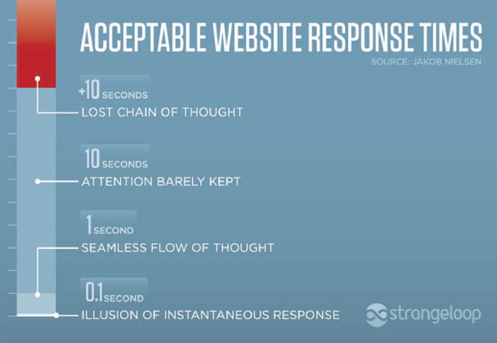
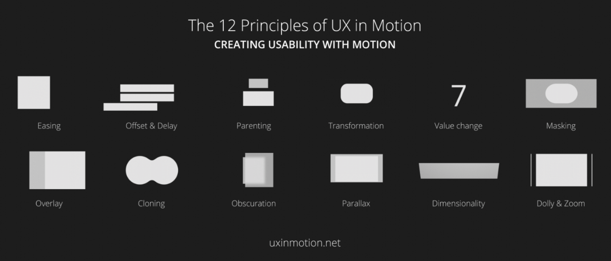

# 2.2.2 Animaties

Animatie is een breed begrip, het kan bijvoorbeeld gaan over een simpele kleurverandering bij een button of een afbeelding die een stukje inzoomt. Maar het kan ook een stuk ingewikkelder, tegenwoordig is er veel mogelijk op het web. Ik wil onderzoeken waarom ik animaties zou gebruiken en op welke manier ik ze ga gebruiken. 

In een artikel van Suter \(z.d.\) kwamen wat interessante punten naar boven. Zo gaat het met animaties om het juiste balans vinden. Je moet goed nadenken over de timing van een animatie. Als een animatie te langzaam of te snel is, zal het de bezoekers gaan irriteren. Hier is onderzoek naar gedaan door Jakob Nielson, dit wordt nu gebruikt als standaard voor web animaties.

Om er zeker van te zijn dat de animaties niet te snel en niet te langzaam zijn is 0.1 seconde de ‘sweet spot’ voor op je website.

De laatste tip die ze nog geeft is dat je animaties moet toepassen om de gebruiker meer betrokken te laten voelen bij je website. Als je begrijpt hoe de gebruiker jouw animaties beleefd dan kan je ze maken zonder ze te frustreren of afleiden.

Een ander artikel wat ik heb gevonden gaat over het belang van goede animaties in UX design. Dit artikel is geschreven door Fanguy \(2018\). De eerste is dat je altijd moet animeren waar de bezoeker moet kijken. Soms gebeurt het dat je een pagina opent en niet weet waar je moet kijken, animatie kan daar de oplossing voor zijn. Dankzij animatie kan je de persoon een richting op sturen waar hij moet kijken.

De animaties moeten een functie hebben. De afbeelding \(GIF\) hieronder geeft wat goede animatie technieken aan. Wat fijn is voor de gebruiker is dat ze feedback krijgen. Zo zien ze dat ze ergens mee bezig zijn. Een paar voorbeeld hiervan is, een animatie die tevoorschijn als iemand een verkeerd wachtwoord heeft ingevoerd.

## Inspiratie

Net als bij de videos heeft awwward ook hier een collectie gemaakt met de beste animaties op het web. Deze is te vinden via : [https://www.awwwards.com/websites/animation/](https://www.awwwards.com/websites/animation/) . Hier kan ik veel inspiratie vandaan halen betreft animaties.

