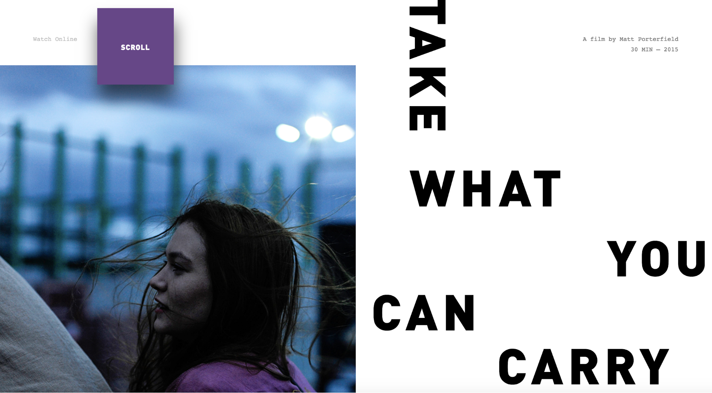

# 2.2.3 Font gebruik

Uiteraard heeft 2nd Chapter een huisstijl met daarin fonts die ik sowieso ga gebruiken op de site. Maar ik wil wel graag wat leuke en creatieve dingen doen met deze fonts.

Op de site Webflow is er een heel artikel \(Driver, 2018\) geschreven over typografie trends op het internet. Een interessante hiervan vond ik de schuine tekst, ze zeggen hier het volgende over:

> This typographic trend turns heads — literally. A mix of horizontal and vertical texts have emerged as a stylistic approach to breaking up blocks of text. The trend creates white space and elicits a wow effect by abandoning the age-old horizontal alignment.  
> \(Mariah Driver, 14-05-2018\)

### Outlined fonts

In een artikel van Frankwatching geschreven door van Dijk \(2019\) kwam ik het volgende tegen:

> Naast 3D zien we nog een opvallende trend. _Outlined fonts_. Waar we al jaren fan zijn van de _ghost buttons_, is nu het font aan de beurt. Er is iets ongrijpbaars aan dit soort lege elementen. Vooral in een wereld waarin dikke schreefloze merken de _branding_ domineren, heeft een visueel lichtere lettervorm dat wat uiteindelijk elke branding nodig heeft: een gevoel dat het zowel revolutionair als betrouwbaar is.  
> \(Jolanda van Dijk, 10-01-2019\)

Een ander artikel van PageCloud geschreven door Mercier\(2019\) kwam ik iets soortgelijks tegen

> Retro vibes have been slowly creeping back into the world of design.
>
> Retro and outlined typography will be one of the most dominant web design trends of 2019. When well-executed, the outlines act as shapes, meaning the type plays a role in boosting your visual composition.  
> \(Alexandra Mercier, 05-04-2019\)

In mijn onderzoek kwam ik deze outline titels vaak tegen. Fonts die alleen een outline hadden gemengd met fonts die wel een binnenste kleur hadden. Ik denk dat dit een mooie manier is om iets visueels te doen met de fonts en het standaard gebruik te vermijden. Ook kan je doormiddel van hovers en animaties nog meer doen met fonts.

