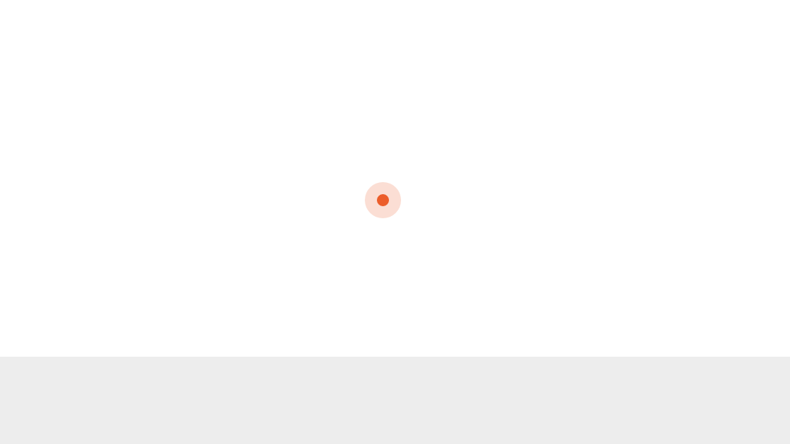
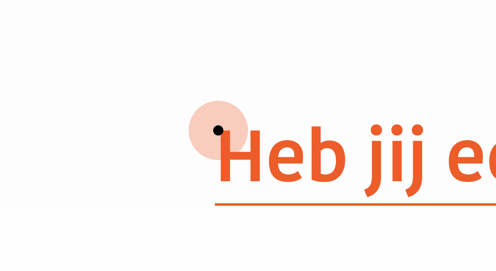
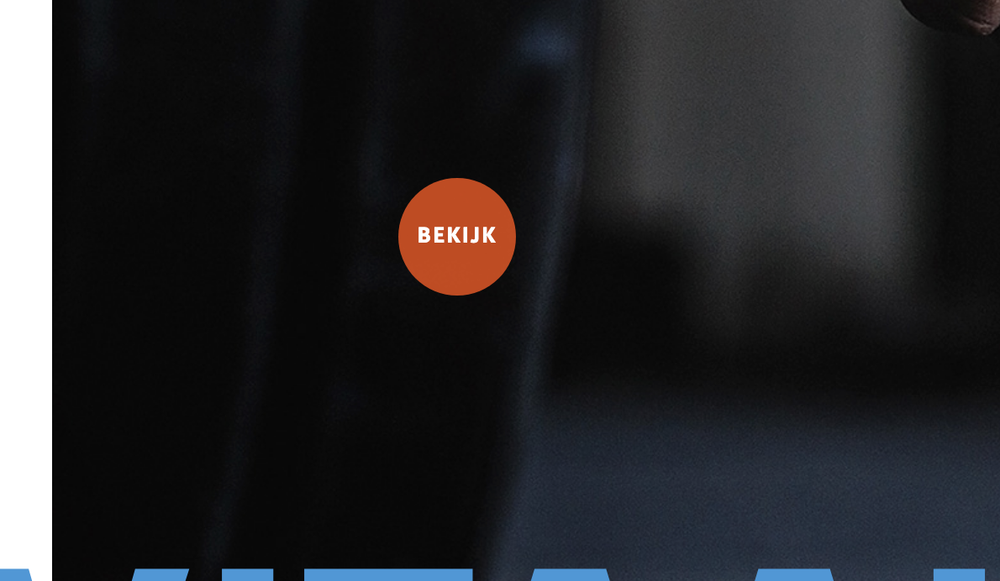

# 2.4.1 Cursor

## Inspiratie / tutorials

* [https://css-tricks.com/using-css-cursors/](https://css-tricks.com/using-css-cursors/)
* [https://codepen.io/MathieuD33/pen/GYRYjW](https://codepen.io/MathieuD33/pen/GYRYjW)
* [https://codepen.io/karlovidek/pen/yvxZjO](https://codepen.io/karlovidek/pen/yvxZjO)
* [https://codepen.io/IvanDiStasio/pen/rZrepy](https://codepen.io/IvanDiStasio/pen/rZrepy)
* [https://onextrapixel.com/10-websites-that-replace-mouse-cursors-for-a-better-cause/](https://onextrapixel.com/10-websites-that-replace-mouse-cursors-for-a-better-cause/)

## Mijn code

Standaard cursor CSS

```text
.cursor {
    width: 8px;
    height: 8px;
    border-radius: 50%;
    position: absolute;
    z-index: 1000;
    transform: translate(-50%, -50%);
    pointer-events: none;
}

.cursor.cursor-shadow {
    background: #ff5000;
    opacity: 0.2;
    transition: all 0.15s ease-out;
    width: 24px;
    height: 24px;
}

.cursor.cursor-dot {
    background: #ff5000;
    transition: width .25s, height .25s;
}
```

Javascript code

```text
// CURSOR
$(window).mousemove(function(e) { 
  $(".cursor").css({
    left: e.pageX,
    top: e.pageY
  })
})

// De bovenste elementen krijgen een class active mee als je eroverheen gaat
$("a, .mousehover, .service-head")
.on("mouseenter", function() {
  $('.cursor').addClass("active")
})

// Als je de elementen verlaat dan krijgt gaat de class active weg
.on("mouseleave", function() {
  $('.cursor').removeClass("active")
})
```

Resultaat:



Als de cursor de class 'active' meekrijgt

```text
.cursor-dot.active {
    width: 12px;
    height: 12px;
    background: #000;
}

.cursor-shadow.active {
    width: 70px;
    height: 70px;
    opacity: 0.3;
}
```

Resultaat:



### Customization

Voor de cases wil ik een custom cursor doen waar het woord 'BEKIJK' instaat. Dit dient dan als call-to-action.

Javascript toevoeging:

```text
// 'Bekijk' cursor
$(".case-item")
.on("mouseenter", function() {
  $('.cursor').addClass("white")
})

.on("mouseleave", function() {
  $('.cursor').removeClass("white")
})
```

CSS toevoeging:

```text
.cursor-dot.active.white {
    background: none;
} 

.cursor-dot.active.white::after {
    content: 'BEKIJK';
    color: #FFF;
    position: absolute;
    z-index: 1000;
    transform: translate(-50%, -50%);
    left: 50%;
    top: 50%;
    font-size: 13px;
    font-weight: 700;
    letter-spacing: 0.8px;
    line-height: normal;
} 

.cursor-shadow.active.white {
    opacity: 0.8;
} 
```

Resultaat:




